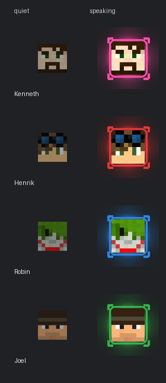

# indicate-speaker

[](https://en.wikipedia.org/wiki/Vibe_coding)
[](https://claude.ai/code)
[](LICENSE)

Per-player "who is speaking" overlays for Minecraft let's-play editing. Each player gets an animated avatar head that reacts to their voice: it lights up, scales, blooms, and shows corner accents while they talk — and breathes slowly while they are quiet.

<p align="center">
  
</p>

Output is one transparent `.mkv` overlay per person (FFV1; `--codec qtrle` gets you a `.mov` instead). Drop them above your footage in Kdenlive (or any NLE that handles alpha), align them to their matching source clip once, and you are done.

---

## Features

- **Spring-physics animation** — the head snaps to attention with a natural overshoot rather than a dimmer-switch fade
- **Multi-layer bloom** — three concentric glow layers (tight core → mid halo → wide ambient) give a luminous, backlit look
- **Corner accents** — L-shaped bracket marks frame the head while speaking, HUD-style
- **Idle breathing** — a slow sinusoidal pulse keeps the indicator visually alive when someone is quiet
- **Adaptive per-person normalisation** — mics recorded far too quietly are detected automatically and get thresholds derived from their own levels, so they light up as strongly as loud ones (`normalize = "auto"`, the default; `--normalize` forces it for everyone)
- **Interactive track discovery** (`--discover`) — lists the audio streams in each MKV and saves your choices back to the config
- **Tight canvas** (default) — encodes only the sprite, ~24× faster and ~3× smaller than a full 1920×1080 frame; position is set once in Kdenlive and saved as an effect favourite
- **Codec choice** (`--codec`) — FOSS `ffv1`/`.mkv` by default (~half the size of the others, archival-grade); alternatives `utvideo` (`.mkv`, fastest timeline scrubbing) and `qtrle` (`.mov`, for tools that only take `.mov`) — all lossless with alpha, all decoding byte-identically
- **Parallel rendering** (`--jobs N`) — processes all players simultaneously on multi-core machines
- **Contact sheet** (`--contact-sheet`) — renders a quiet-vs-speaking PNG preview before you commit to a full encode
- **Envelope plots** (`--plot`) — a per-person timeline PNG of loudness, gate thresholds, and speaking activation, so threshold tuning is something you can see instead of guess
- **Talk stats** (`--stats`) — per-person talk time, talk share, and longest monologue as Markdown + CSV per episode

---

## Requirements

| Dependency | Version | Notes |
|---|---|---|
| Python | 3.11+ | Uses `tomllib` (stdlib) |
| [NumPy](https://numpy.org/) | any recent | Audio analysis and per-frame compositing |
| [Pillow](https://python-pillow.org/) | any recent | Sprite rendering |
| [FFmpeg](https://ffmpeg.org/) | any recent | Audio decode and video encode — must be on `PATH` |

---

## Installation

```bash
# 1. Clone the repository
git clone https://github.com/seetee/indicate-speaker.git
cd indicate-speaker

# 2. Install Python dependencies
pip install numpy Pillow

# 3. Verify FFmpeg is available
ffmpeg -version
```

No build step, no package to install — it is a single script. With [uv](https://docs.astral.sh/uv/) you can skip step 2 entirely: `uv run indicate-speaker.py …` reads the script's inline dependency metadata (PEP 723) and fetches NumPy and Pillow automatically.

---

## Quick start

```bash
# The common case: run from inside the episode's sources folder — everyone
# renders in parallel, quiet mics are handled automatically
cd /path/to/episode/sources && python3 /path/to/indicate-speaker.py

# Or pass an episode folder (or a root holding several) as the argument
python3 indicate-speaker.py /path/to/episode

# Preview the look of all heads (no MKV files needed)
python3 indicate-speaker.py --contact-sheet

# First time with a new recording setup: identify voice tracks interactively
python3 indicate-speaker.py --discover

# Check audio analysis without rendering anything
python3 indicate-speaker.py --dry-run

# Render only the first 30 seconds for a quick look
python3 indicate-speaker.py --preview 30
```

The config file (`indicate-speaker.toml`) is found automatically when it lives next to the script, so you do not need to pass it on the command line. The episode is taken from the current directory: when that folder does not itself contain the MKVs, the script searches up to two levels below it (e.g. `session_NN_DATE/sources/`) and uses the newest complete episode, printing which one it chose — and when nothing is found at all, it simply asks for the sources directory.

---

## Usage

```
python3 indicate-speaker.py [CONFIG.toml | EPISODE_DIR] [options]
```

If `CONFIG.toml` is omitted the script looks for `indicate-speaker.toml` next to itself, then for the only `.toml` file in the current directory. Passing a **directory** as the positional argument is shorthand for `--indir`.

### Options

| Flag | Default | Description |
|---|---|---|
| `--indir DIR` | current directory | Folder with the episode's MKVs, or a root holding several — the newest complete episode up to two levels below is used; prompts when nothing is found |
| `--outdir DIR` | the episode folder | Where to write the overlay files |
| `--date YYYY-MM-DD` | newest | Pick a specific episode when the folder holds several |
| `--jobs N` / `-j N` | config's `jobs`, else `1` | Render N players in parallel |
| `--canvas tight\|full` | `tight` | `tight`: sprite only (fast, small). `full`: 1920×1080 frame (drop straight on track) |
| `--codec ffv1\|utvideo\|qtrle` | `ffv1` | Overlay codec, all lossless with alpha: `ffv1` (`.mkv`, smallest), `utvideo` (`.mkv`, fastest scrubbing), `qtrle` (`.mov`, for tools that only take `.mov`) |
| `--person NAME` | all | Only process this person; repeatable |
| `--discover` | off | Interactively pick each person's voice track; saves choices to config |
| `--normalize` | auto | Force per-person thresholds for everyone (by default they apply automatically only to tracks the configured gate clearly fails) |
| `--contact-sheet` | off | Write a PNG preview of all heads and exit |
| `--plot` | off | Write `<name>_envelope.png` timelines (loudness, thresholds, activation) next to the overlays |
| `--stats` | off | Write `talk_stats.md`/`.csv` (talk time, share, longest monologue); combine with `--dry-run` to skip rendering |
| `--sync` | off | Compute each recording's start offset from a shared audio track (see [Automatic sync](#automatic-sync)) |
| `--sync-window SECONDS` | `1800` | How much of each recording `--sync` reads; `0` = whole file |
| `--refresh-heads` | off | Re-download avatar heads instead of using cached copies |
| `--preview SECONDS` | off | Only process the first N seconds (also skips the slow track-bleed check) |
| `--skip-existing` | off | Leave finished overlays alone — cheap retry after one person's render failed |
| `--dry-run` | off | Analyse audio and report speaking time; render nothing |

### Source file naming

Each MKV must be named `YYYY-MM-DD_<suffix>.mkv`, where `<suffix>` matches the `suffix` field in the config. For example, a config with `suffix = "k"` and `--date 2026-06-27` looks for `2026-06-27_k.mkv`.

If the folder contains exactly one episode (one file per suffix), `--date` can be omitted. If `--indir` points at a root rather than an episode folder, the newest complete episode found up to two levels below it is used; `--date` picks an older one.

### Automatic sync

`--sync` cross-correlates a shared audio signal across everyone's recordings and prints each recording's start offset relative to the first person — numbers you can type straight into Kdenlive instead of aligning waveforms by eye. When `--stats` runs in the same invocation, the offsets also unlock cross-person statistics (interruptions).

It only works when the recordings genuinely share a signal, and it **refuses rather than guesses** when they don't (the correlation peak must be at least 3× stronger than any rival alignment). Separate mic tracks do not qualify — each machine only hears its own player. The one-time setup that makes it work:

1. In OBS on **every** machine, add the voice-chat output (e.g. the Discord playback device) as an audio source routed to its own track.
2. Give that track the same title everywhere, e.g. `Voice chat` (set it in *Advanced Audio Properties* / the recording track labels).
3. Point the config at it:

```toml
[sync]
stream_title = "Voice chat"   # the shared track; per-person override: sync_title
```

Without a `[sync]` section, `--sync` falls back to each person's voice track — which only works if the voice chat is mixed into it.

### Kdenlive workflow

1. **Tight canvas** (default): after importing an overlay, add a **Transform** effect, set *Size* to the sprite's native pixel dimensions and *Position* to the `X=… Y=…` values printed by the script. Save it as an effect favourite to re-apply in one click.
2. Align the overlay to its matching source by waveform (mute the overlay audio track afterwards — it is there only to aid sync).
3. Group the overlay with its source clip so they stay together when you cut.
4. Optionally select all overlays and create a **Sequence** so they become one tidy, cuttable object that never shifts relative to each other.

---

## Configuration reference

All settings live in a TOML file (default: `indicate-speaker.toml`). Every field listed below has a built-in default; only include the lines you want to override.

### `[project]`

```toml
[project]
width        = 1920
height       = 1080
fps          = 60
stream_title = "Voice audio"   # audio stream title to use for all players
```

`stream_title` is the project-level default. Individual `[[person]]` sections can override it. Use `--discover` to find the right value automatically.

### `[input]`

```toml
[input]
dir  = "/path/to/episode"   # equivalent to --indir (default: the directory
                            # the script is run from)
date = "2026-06-27"         # equivalent to --date; omit to use the newest
```

### `[output]`

```toml
[output]
dir    = "/path/to/out"   # equivalent to --outdir (default: the episode folder)
canvas = "tight"          # equivalent to --canvas
codec  = "ffv1"           # equivalent to --codec: ffv1 | utvideo | qtrle
jobs   = 4                # equivalent to --jobs (default: 1)
```

All three codecs are lossless with alpha and decode to byte-identical frames; they differ in file size and how smoothly Kdenlive scrubs them. On a 60 s test render: `ffv1` ≈ half the size of `qtrle`, `utvideo` ≈ 10 % smaller and the fastest to encode and decode. The `.mkv` outputs carry the sync voice as FLAC instead of AAC (AAC's priming delay would shift the video by ~21 ms in Matroska).

### `[layout]`

Controls the visual appearance of the overlay.

```toml
[layout]
head_size     = 56     # head size in px at 100% activation (speaking)
gap           = 8      # vertical gap between heads, px
margin_top    = 12     # px from the top edge of the canvas
margin_left   = 12     # px from the left edge of the canvas
silent_scale  = 0.88   # head scale when fully quiet (1.0 = same as speaking)
silent_dim    = 0.78   # head brightness/alpha when fully quiet
glow_strength = 0.55   # peak bloom opacity (scales all three glow layers)
ring_width    = 3      # thickness of the rounded-rectangle ring, px
breath_freq   = 0.40   # Hz; idle breathing pulse rate (lower = slower)
breath_scale  = 0.06   # ±fraction brightness swing while silent (0 = off)
```

### `[gate]`

Controls how loudness is mapped to the 0–1 speaking activation.

```toml
[gate]
open_db              = -38.0  # activation starts rising above this dBFS
full_db              = -16.0  # activation hits 1.0 at/above this dBFS
close_db             = -46.0  # below this, forced to silence (ignores room tone)
spring_stiffness     = 400.0  # k; higher = faster snap to speaking
spring_damping_ratio = 0.65   # ζ; 1.0 = no overshoot, 0.4 = noticeably bouncy
normalize            = "auto" # "auto" | true | false — see below
norm_low_pct         = 15.0   # percentile of active frames mapped to open_db
norm_high_pct        = 90.0   # percentile of active frames mapped to full_db
```

**`normalize`** handles players with significantly different mic levels: it measures a person's own loudness distribution (noise floor and speech peak) and derives all three thresholds from it, so a quieter mic lights up the indicator just as strongly as a loud one — even a mic recorded tens of dB below the configured thresholds. The default `"auto"` applies this only to tracks the configured thresholds clearly fail (the head would stay dark, or nearly so, for the whole episode) — well-levelled mics keep the predictable absolute thresholds, and whoever's mic happens to be too quiet this session is caught automatically. `true` derives thresholds for everyone (also forceable per-run with `--normalize`); `false` disables it.

Any `[gate]` value can also be set inside a `[[person]]` section to override it for that person only — handy for one unusually quiet or loud mic.

The script also warns when something looks wrong with the audio: when a person's loudness never reaches the gate (the head would stay dark for the whole episode), and when another stream — typically game audio — appears to bleed into the chosen voice track (checked by correlating the streams over a sample from the middle of the recording). All warnings are repeated in a summary at the end of the run, so they are not lost between progress lines when rendering with `--jobs`.

### `[[person]]`

One section per player, in the order they should appear top-to-bottom on screen.

```toml
[[person]]
name         = "Kenneth"
suffix       = "k"              # matches YYYY-MM-DD_k.mkv
nick         = "seetee"         # Minecraft username; fetches head from mc-heads.net
colour       = "#ff4da6"        # ring, glow, and corner accent colour
# head_file  = "heads/k.png"   # use a local PNG instead of mc-heads.net
# stream_title = "Voice audio" # overrides [project] stream_title for this person
# open_db    = -60.0           # any [gate] value can be overridden per person
```

`nick` and `head_file` are mutually exclusive; at least one is required. Downloaded heads are cached in `~/.cache/indicate-speaker/`, so renders work offline after the first fetch; pass `--refresh-heads` after someone changes their skin. Run `--discover` once after a new recording session if the audio track names have changed — it will find the right `stream_title` for each player and write it into the config.

---

## Development

Tests live in `tests/` and run either way:

```bash
python3 tests/test_indicate_speaker.py                            # no extra deps
uv run --with pytest --with numpy --with pillow -m pytest tests/  # via pytest
```

---

## License

GNU Affero General Public License v3.0 or later. See [LICENSE](LICENSE).
